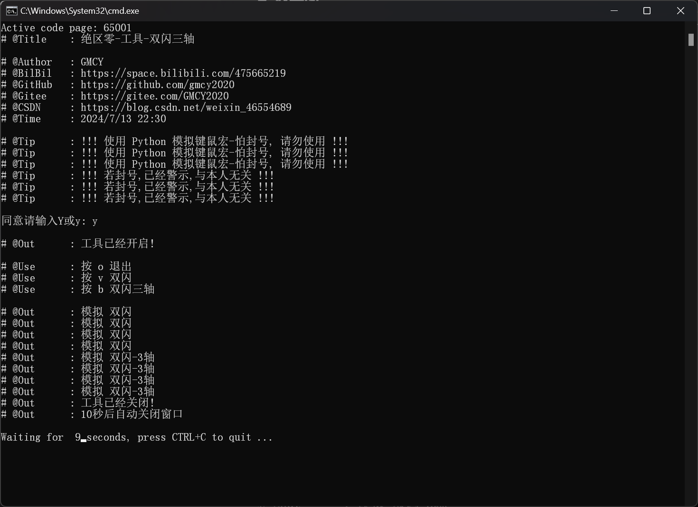

# 绝区零 双闪 双闪-三轴 工具

## 0. 演示视频

- B站演示: [BilBil](https://www.bilibili.com/video/BV1pcbjeEECm)
- B站演示: [BilBil](https://www.bilibili.com/video/BV1mQbLesEtK)

## 1. 基本信息

- 作者: GMCY
- 系列: 工具系列
- 仓库: [GitHub](https://github.com/GMCY2020/Tools-ZZZ-DoubleFlash) | [Gitee](https://gitee.com/GMCY2020/Tools-ZZZ-DoubleFlash)
- 话题(GitHub): [Tools](https://github.com/topics/Tools) \ [ZenlessZoneZero](https://github.com/topics/ZenlessZoneZero)
- 创建时间: 2024/07/14

## 2. 声明

- **!!! 使用 Python 模拟键鼠宏-怕封号, 请勿使用 !!!**
- **!!! 使用 Python 模拟键鼠宏-怕封号, 请勿使用 !!!**
- **!!! 使用 Python 模拟键鼠宏-怕封号, 请勿使用 !!!**
- **!!! 若封号,已经警示,与本人无关 !!!**
- **!!! 若封号,已经警示,与本人无关 !!!**
- **!!! 若封号,已经警示,与本人无关 !!!**

## 3. 介绍

- 该工具为 绝区零 双闪-三轴 键鼠宏 工具
- 绝区零大佬们新的研发成果: 理论存在, 实践可行但有难度的 `双闪` 甚至 `双闪-三轴`
- 双闪 (触发两次极限闪避攻击): `闪` -> `A` -> `切人` -> `闪` -> `A`
- 双闪-三轴 (三个角色在场输出): `闪` -> `A` -> `切人` -> `闪` -> `A` -> `切人` -> `攻击`

- 人操作有难度, 我操作只有不到30%的概率触发 `双闪`, 但咱是破敲代码的, so ~~

- 通过 python 写个工具, 模拟 玩游戏时 的 键鼠 操作, 可以极大提高 触发 `双闪` 的概率, 甚至可以打出 `双闪-三轴`, 只需在需要闪避时按个 按键 就模拟, 进而触发。
- 该工具 切人 使用的是 `c` 切, 而不是 `空格`, 所以 `没有点数下也可以触发`
- 该工具 是 `手动触发` `不是自动`
- 该工具 触发 `有概率` `不是100%`

## 4. 使用

- 先解压 `Tools-ZZZ-DoubleFlash.zip`
- 然后 双击 `双击我.bat`
- (如果只运行 `main.exe`, 无法监听和模拟键鼠操作)
- (所以, 使用 批处理文件 默认请求管理员权限)
- 输入 y 同意免责 使用
- 在怪物闪光时 按下 `v` 模拟键鼠 `双闪`
- 在怪物闪光时 按下 `b` 模拟键鼠 `双闪-三轴`
- 按下 `o` 退出

## 4. 效果图

